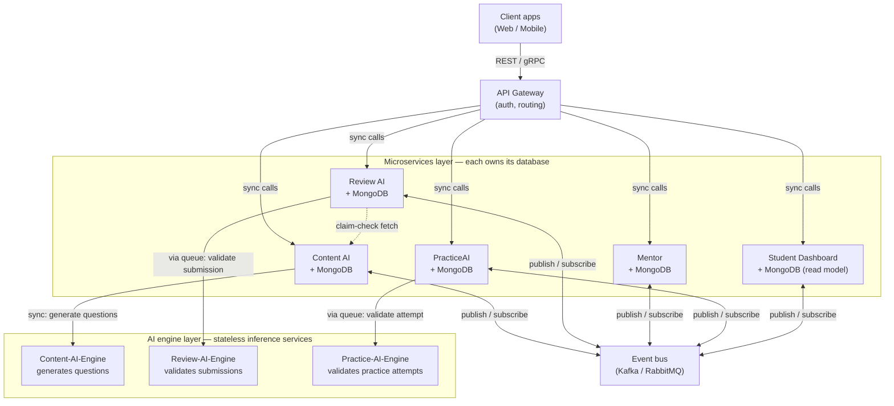
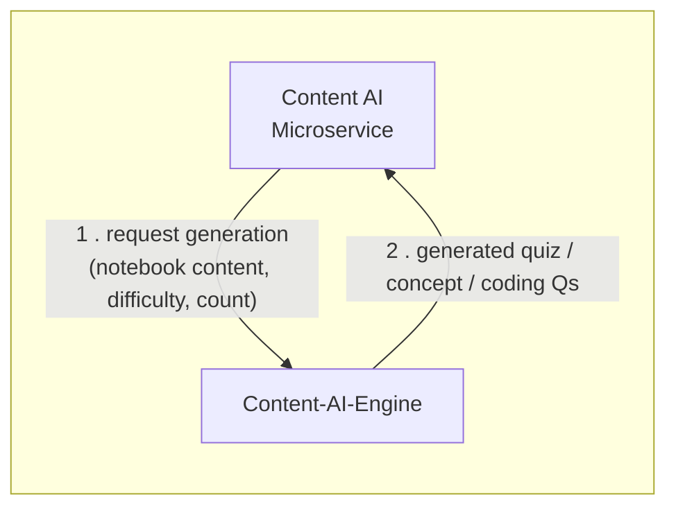
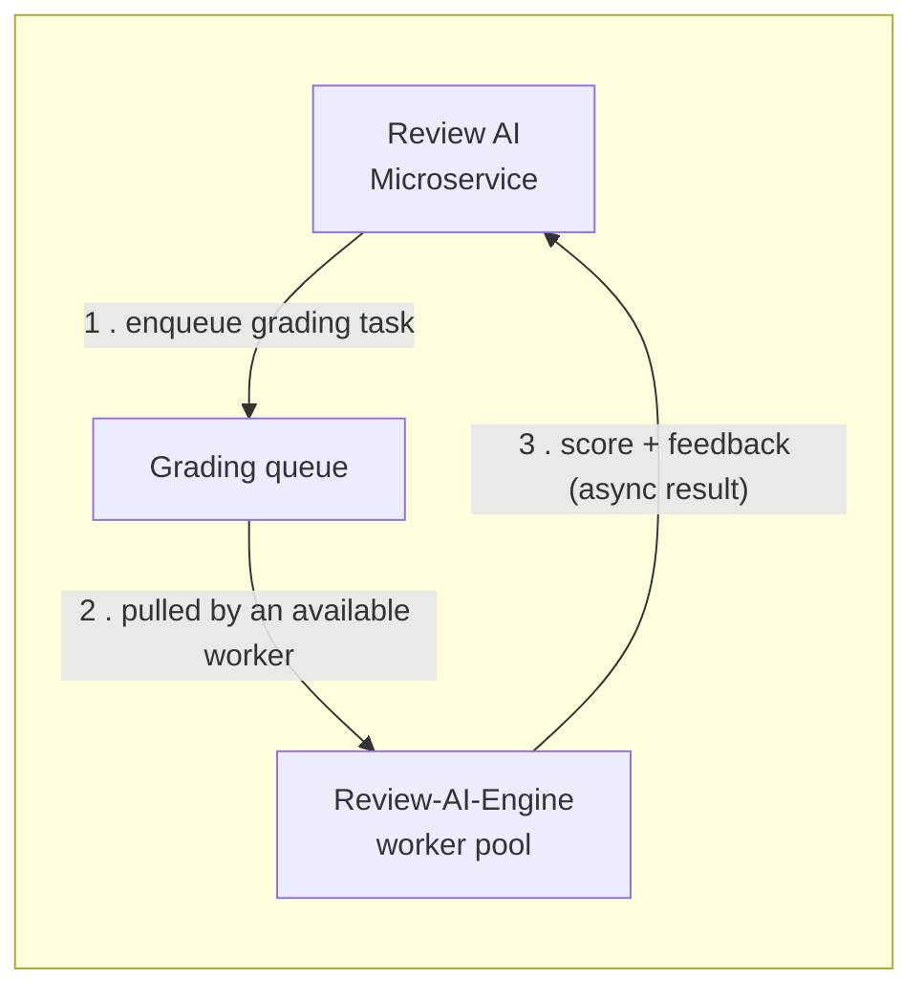
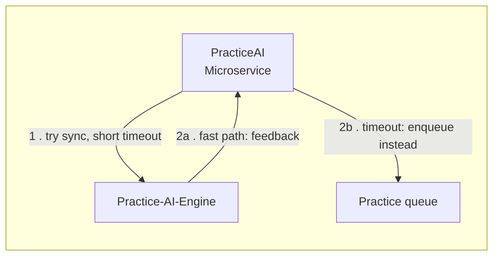
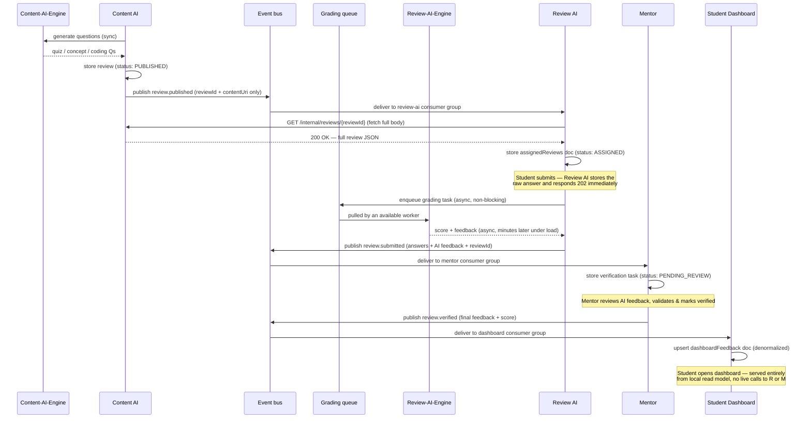
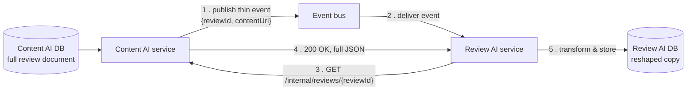
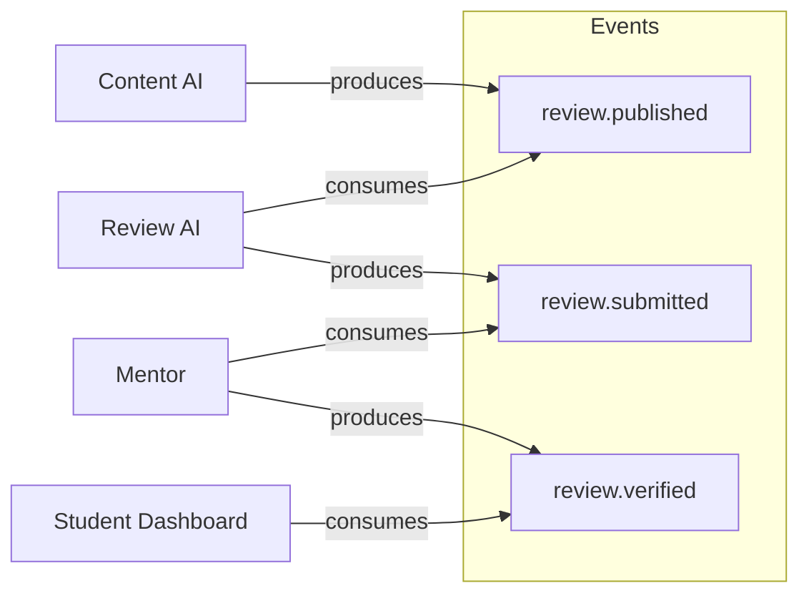
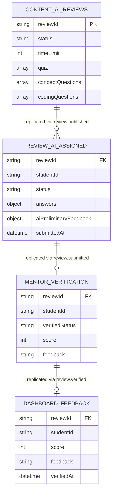
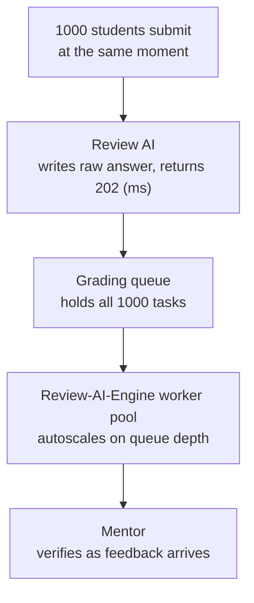

# LMS platform — microservices architecture & inter-service communication

## 1. Overview

The platform is composed of five independently deployable services, each owning a private database (MongoDB). Three of them are backed by a dedicated **AI engine** for generation or validation work. No service reads or writes another service's database directly. All cross-service interaction happens through one of these channels:

| Channel | Used for | Protocol |
|---|---|---|
| **API Gateway** | Client-facing requests that need an immediate response | REST / gRPC (synchronous) |
| **Event bus** | Cross-service workflows that don't need an immediate response | Kafka / RabbitMQ (asynchronous, pub/sub) — thin events only, see §5 |
| **Internal REST (service ↔ service)** | Fetching a full payload referenced by a thin event | REST, service token / mTLS, not exposed via the public Gateway |
| **Internal REST (service ↔ AI engine)** | Low-volume, real-time generation calls (e.g. Content AI authoring) | REST/gRPC, synchronous — the caller blocks on the result |
| **Task queue (service → AI engine workers)** | High-volume validation calls that can spike (e.g. 1000 students submitting at once) | Queue + worker pool, asynchronous — caller is acknowledged immediately, result arrives later (see §9) |

| Service | Responsibility | AI engine | Owns |
|---|---|---|---|
| Content AI | Authors content, generates review sets (quizzes, concept questions, coding questions) | **Content-AI-Engine** — generates the questions | `reviews`, `notebooks` collections |
| Review AI | Serves assigned reviews to students, accepts submissions | **Review-AI-Engine** — validates submitted answers, produces preliminary feedback | `assignedReviews`, `submissions` collections |
| Mentor | Validates and verifies submitted reviews (human-in-the-loop) | — none, human judgment only | `verifications` collection |
| PracticeAI | Lets students freely practice generated questions outside the formal review flow | **Practice-AI-Engine** — validates practice submissions, returns instant feedback | `practiceSessions` collection |
| Student Dashboard | Read-optimized view of a student's review-wise feedback | — none, pure read model | `dashboardFeedback` collection (denormalized) |

---

## 2. High-level architecture



**Why this shape:**
- The Gateway handles *queries* — where the client is waiting on the response.
- The event bus handles *workflows* — where no one is waiting synchronously, and multiple services may care about the same event over time.
- The **AI engine layer** is a separate tier from the business microservices. Engines are stateless inference services (own no database) — they take structured input, run generation or validation logic (LLM/ML), and return a structured result. Each microservice owns the *business* decision (what to store, what status to set, what event to fire); the engine only owns the *inference* step.
- Content-AI-Engine is called **synchronously** — authoring is low-volume (one content creator at a time), so blocking briefly is fine. Review-AI-Engine and Practice-AI-Engine are called through a **task queue**, not directly — student submissions can spike (many students submitting near a deadline), and a direct synchronous call at that volume would exhaust connections and time out. See §9 for why and how.
- Mentor and Student Dashboard have no engine: Mentor's job is human judgment, not inference; Dashboard never computes anything, it only replays events into a read model.

---

## 3. The AI engine layer

Each engine is purpose-built for one microservice and one job. None of them are shared or called cross-service — Review AI never calls Content-AI-Engine, PracticeAI never calls Review-AI-Engine.







| Engine | Called by | Trigger | Call pattern | What it returns | What happens to the result |
|---|---|---|---|---|---|
| **Content-AI-Engine** | Content AI | Author publishes/generates a new review | Direct synchronous call — low volume, one author at a time | Generated `quiz`, `conceptQuestions`, `codingQuestions` (the JSON structure from §5) | Content AI persists it as the source-of-truth review, then publishes the thin `review.published` event |
| **Review-AI-Engine** | Review AI | Student submits a review | Queue + worker pool — volume can spike (many submissions near a deadline), see §9 | Preliminary score + AI-generated feedback per question, delivered async | Review AI attaches it once ready and includes it in the `review.submitted` event, so Mentor sees AI-assisted feedback before final human verification |
| **Practice-AI-Engine** | PracticeAI | Student submits a practice attempt | Hybrid — short synchronous attempt, falls back to queue + notification if the engine is backlogged | Feedback + correctness | Returned straight to the student, either immediately or via notification once ready — practice is low-stakes, so it skips Mentor entirely; no event is published |

**Why Review AI's flow still goes to Mentor, but PracticeAI's doesn't:** a formal review counts toward the student's record, so it always gets a human verification step even though the AI engine pre-scores it — the AI feedback is assistive, not final. A practice attempt is disposable self-study, so the AI engine's verdict *is* the final answer; there's no human in that loop and no `verified` event to propagate.

---

## 4. The review lifecycle as an event-driven saga

The core services are stages of a single pipeline, modeled as a **choreographed saga** — each service reacts to an event and publishes the next one, with no central orchestrator. The AI engine calls from §3 now sit inline at the points where each service needs an inference result before it can act.



**Key property:** the student's submit request never waits on Review-AI-Engine. Their `202` came back before grading even started. If 1000 students submit in the same minute, the queue absorbs all 1000 instantly; the engine works through them at its own pace without a single submission timing out.

---

## 5. Data replication: the claim-check pattern

When a review's JSON is large (many questions, large coding-problem bodies, embedded rubrics), you don't want that riding on the event bus — big messages slow down the broker for every other event on the topic, blow past broker message-size limits, and force every consumer to deserialize a huge blob even if it only needed to know "a review exists." The fix is the **claim-check pattern**: the event carries a *pointer*, not the *payload*. The consumer fetches the full content on demand, only when it actually needs it.



### Step by step

**Step 1 — Content AI publishes a thin event (pointer only, no quiz content):**
```json
{
  "eventType": "review.published",
  "eventId": "evt_9a3f...",
  "reviewId": "6a64d9103e0a2ebd1e5ef484",
  "occurredAt": "2026-07-28T09:12:00Z",
  "contentUri": "/internal/reviews/6a64d9103e0a2ebd1e5ef484",
  "checksum": "sha256:4f2a...",
  "sizeBytes": 184320
}
```
This is now a few hundred bytes regardless of how large the actual review gets — the bus stays fast and cheap no matter how big your coding problems or rubrics grow.

**Step 2 — Review AI's consumer receives the thin event** and sees it needs the body, but doesn't have it yet.

**Step 3 — Review AI calls Content AI's internal endpoint directly** (not through the public Gateway — this is service-to-service, authenticated with a service token or mTLS):
```
GET /internal/reviews/6a64d9103e0a2ebd1e5ef484
Authorization: Bearer <service-token: review-ai>
```

**Step 4 — Content AI returns the full document** (`quiz`, `conceptQuestions`, `codingQuestions`, `timeLimit`, etc. — the same shape the Content-AI-Engine originally generated). Review AI verifies the `checksum` from the event against the fetched body to guard against a partial/corrupted read.

**Step 5 — Review AI reshapes and persists its own copy**, stripping `validOptions`/`explanation` from the quiz (so answer keys never reach the student's client), adding its own tracking fields:
```json
{
  "_id": "ObjectId(...)",
  "reviewId": "6a64d9103e0a2ebd1e5ef484",
  "studentId": null,
  "status": "ASSIGNED",
  "timeLimit": 31,
  "quiz": [{
    "id": "6a5f0f9bb9d092999f2f60cd",
    "question": "Which of the following is a characteristic of an \"object\"..."
  }],
  "conceptQuestions": [ ... ],
  "codingQuestions": [ ... ],
  "answers": {},
  "submittedAt": null,
  "sourceEventId": "evt_9a3f..."
}
```

Once step 5 completes, Review AI is fully self-sufficient again — it never calls Content AI a second time to serve this review to a student.

### Where the blob actually lives

| Option | When to use | How the pointer looks |
|---|---|---|
| **Producer's own internal REST endpoint** (as above) | Content is structured JSON, no large binary assets — this fits your case | `contentUri: "/internal/reviews/{reviewId}"`, fetched via service-to-service call |
| **Object storage (S3 / GridFS) with a signed URL** | Content includes large binary assets — images, video, attached starter-code archives | `contentUri: "https://storage.example.com/reviews/{id}?sig=..."`, fetched directly from storage, bypassing Content AI entirely |

For your current payload (quizzes, concept questions, coding problems as text) — option 1 is simpler and keeps Content AI as the single authority to query for "what does this review actually contain right now."

### Rules that make this safe

| Concern | Rule |
|---|---|
| Idempotency | Review AI checks `sourceEventId` before writing — brokers guarantee *at-least-once* delivery |
| Correlation | `reviewId` is the shared key across all five services' databases |
| Immutability | Once `review.published` fires, `contentUri` points to a frozen snapshot. A later edit in Content AI creates a new `reviewId`, never mutates the one behind an already-fired `contentUri` |
| Data integrity | The `checksum` in the thin event lets the consumer verify the fetched body wasn't corrupted or partially written |
| Fetch failure | If the `GET` to Content AI fails, Review AI's consumer does **not** ack the event — it retries with backoff, or after N failures routes to a dead-letter queue for manual replay |
| Fetch timing | Consumers should fetch promptly after receiving the event — if Content AI ever archives old snapshots, define a retention window that outlives your longest-expected consumer lag |
| Schema versioning | Event types are versioned (`review.published.v1`) independently of the content schema behind `contentUri` |

---

## 6. Event catalog



| Event | Producer | Consumer(s) | Payload | Claim-check? |
|---|---|---|---|---|
| `review.published` | Content AI | Review AI | reviewId, contentUri, checksum, sizeBytes | Yes — fetch via `GET /internal/reviews/{reviewId}` |
| `review.submitted` | Review AI | Mentor | reviewId, studentId, answers, aiPreliminaryFeedback, submittedAt | Only if `answers` includes large coding submissions — otherwise inline is fine |
| `review.verified` | Mentor | Student Dashboard | reviewId, studentId, score, feedback, verifiedAt | No — feedback payload is small, inline is fine |

Note the new `aiPreliminaryFeedback` field on `review.submitted` — this is Review-AI-Engine's output riding along with the event, so Mentor sees it without a second lookup. PracticeAI intentionally has no row here: its engine's output never becomes an event, since practice attempts don't flow through the saga.

---

## 7. Data ownership (entity-relationship view per service)



Each box above is a **separate physical database** — the relationships shown are logical (via `reviewId`), not foreign keys enforced at the DB level. The AI engines don't appear here because they own no database — they're pure compute, not storage.

---

## 9. Scaling the AI engine layer under burst load

**The problem:** AI engines (LLM/ML inference) are slow relative to a normal API call — hundreds of milliseconds to several seconds per request. If a microservice calls its engine synchronously inside a client-facing request, then a burst of concurrent users (1000 students submitting near a deadline) means 1000 simultaneous open connections all waiting on a slow dependency. That exhausts connection pools and thread capacity on the calling service, and requests start timing out well before all 1000 finish — a cascading failure, not a slowdown.

**The fix: never let a client-facing request block on an engine call whose volume can spike.** Decouple acknowledgment from processing:



- **Ingestion is cheap, keep it in the hot path.** Writing the raw submission to Review AI's DB and returning `202 Accepted` takes milliseconds — this scales to thousands of concurrent requests with normal horizontal scaling of the Review AI service and its database.
- **Grading is slow, take it out of the hot path.** The engine call happens from a **worker pool** pulling off a queue (SQS, RabbitMQ, or a dedicated Kafka topic), not from the request thread. The queue is the shock absorber — it can hold all 1000 tasks instantly; nothing is dropped, nothing times out.
- **Autoscale workers on queue depth**, not CPU. If the queue backs up, add workers (bounded by a max replica count tied to cost/GPU availability); if it drains, scale down.
- **Rate-limit the engine calls**, especially if it wraps a third-party LLM API with its own rate limits — a token-bucket limiter on the worker pool prevents the workers themselves from overwhelming the model provider and getting throttled.
- **Batch where the model supports it.** Many LLM providers accept batched requests — grading 20 submissions in one call is far more throughput-efficient than 20 separate calls, if your engine's provider supports it.
- **Degrade gracefully, don't block the saga.** If the engine is down or consistently timing out, treat AI feedback as optional enrichment: Mentor can still verify manually without it rather than the whole pipeline stalling. A circuit breaker on the worker side stops hammering a failing engine and lets it recover.
- **PracticeAI's UX wants "instant," so use a hybrid.** Try a synchronous call with a short timeout (2–3s); if it doesn't return in time, fall back to the same queue pattern and notify the student (poll or push) once the result is ready, instead of holding the connection open indefinitely.

**Rough capacity math for your 1000-submission scenario:** if Review-AI-Engine can sustainably process 20 requests/second across its worker pool, the full batch finishes grading in about 50 seconds — entirely in the background. No student's submit request waits anywhere near that long; they were acknowledged in milliseconds. The number to actually engineer around isn't "can we handle 1000 requests," it's "what's an acceptable grading turnaround time," and you tune worker count to hit that target.

---

## 10. Cross-cutting concerns

- **Auth**: Gateway issues/validates short-lived JWTs; internal service-to-service and service-to-engine traffic can additionally use mTLS.
- **Failure handling**: Each event consumer has a dead-letter queue. Each engine call has a timeout + retry/circuit-breaker — if Content-AI-Engine is slow or down, Content AI should fail the generation request cleanly rather than hang the caller.
- **Observability**: Every event and API call carries a `reviewId`/correlation ID, including engine calls, so one student's review can be traced end-to-end — generation, assignment, AI pre-scoring, human verification, dashboard update.
- **Consistency model**: The system is *eventually consistent* across services (e.g. dashboard updates a moment after Mentor verifies) but *strongly consistent* within a single service's own database. Engine calls are synchronous request/response, so their result is immediately consistent with the caller.
- **Internal-only surface**: Endpoints like Content AI's `GET /internal/reviews/{reviewId}`, and every engine's inference endpoint, must never be exposed through the public Gateway — reachable only from other services on the internal network, authenticated with service tokens/mTLS.
- **Engine scaling**: Engines are stateless, so they scale horizontally behind a simple load balancer independent of their calling microservice — a spike in review submissions can scale Review-AI-Engine without touching Review AI's own instance count.
- **Burst load**: high-volume validation calls (Review AI, PracticeAI) go through a queue + worker pool, never a direct blocking call from the client-facing request — see §9.

---

## 11. Summary

- **Gateway** = synchronous, client-facing reads/writes.
- **Event bus** = asynchronous, service-to-service workflow propagation.
- **AI engine layer** = stateless inference calls — sits below the microservice, never called cross-service, never on the event bus. Content-AI-Engine is called synchronously (low volume). Review-AI-Engine and Practice-AI-Engine go through a **queue + autoscaled worker pool** (high, bursty volume) so a spike like 1000 concurrent submissions never blocks a client-facing request.
- **No shared databases, ever** — only events, versioned REST contracts, and engine calls cross service boundaries.
- **Claim-check for large payloads** — events carry `reviewId` + `contentUri`, not the full document.
- **Review AI blends AI + human**: Review-AI-Engine pre-scores, Mentor gives the final verified verdict. **PracticeAI is AI-only**: Practice-AI-Engine's verdict is final, no human step, no saga event.
- **Student Dashboard is a read model**, not a live aggregator — built entirely from consumed events.
- **Immutable snapshots + idempotent consumers + correlation IDs + checksums** are what make the eventual consistency safe in practice.
