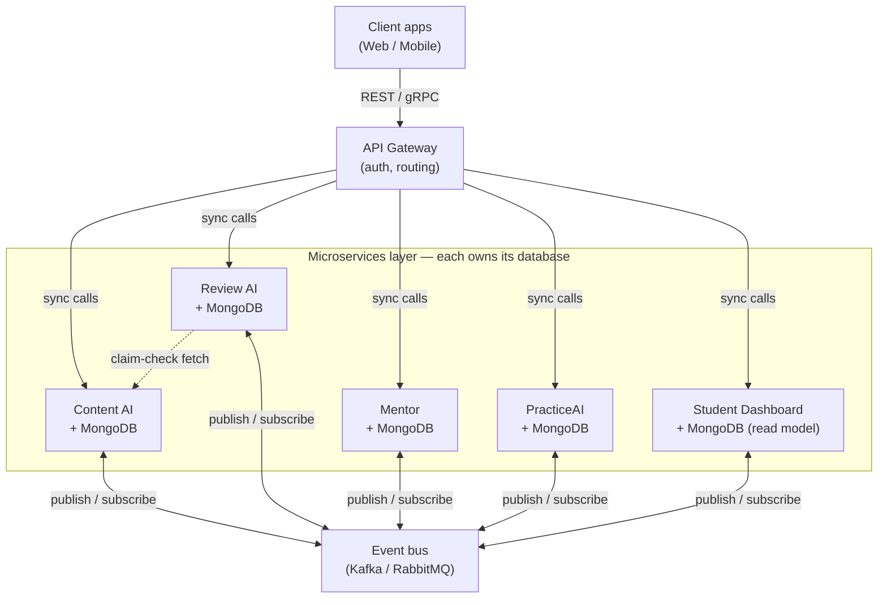
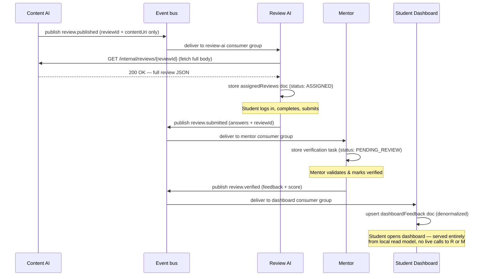
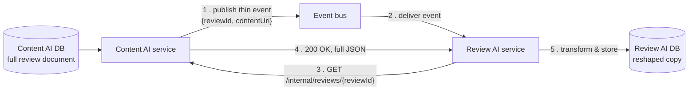
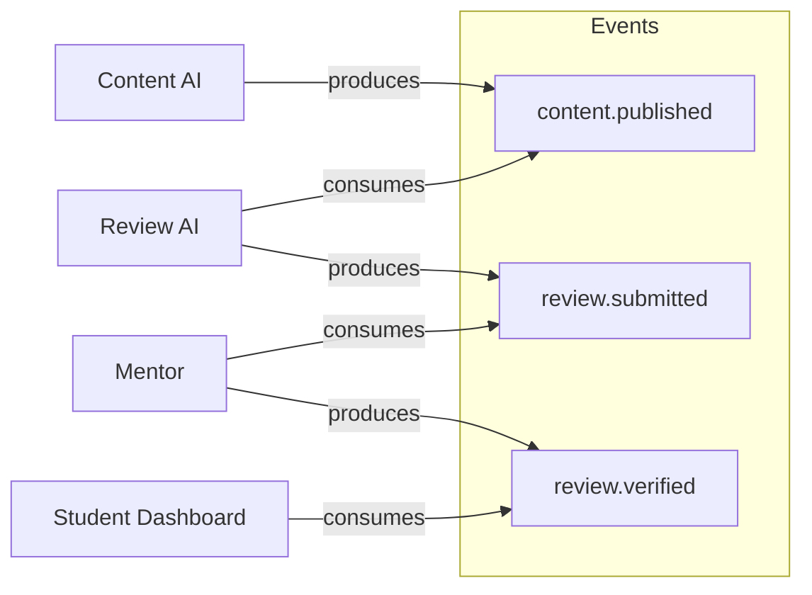
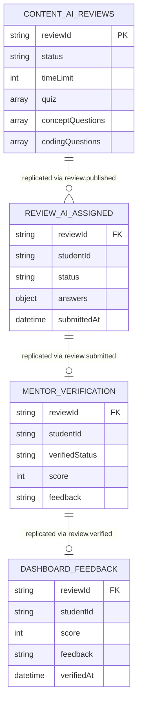

# LMS platform — microservices architecture & inter-service communication

## 1. Overview

The platform is composed of five independently deployable services, each owning a private database (MongoDB). No service reads or writes another service's database directly. All cross-service interaction happens through one of two channels:

| Channel | Used for | Protocol |
|---|---|---|
| **API Gateway** | Client-facing requests that need an immediate response | REST / gRPC (synchronous) |
| **Event bus** | Cross-service workflows that don't need an immediate response | Kafka / RabbitMQ (asynchronous, pub/sub) — thin events only, see §4 |
| **Internal REST (service-to-service)** | Fetching a full payload referenced by a thin event | REST, authenticated with a service token / mTLS, not exposed via the public Gateway |

| Service | Responsibility | Owns |
|---|---|---|
| Content AI | Authors content, generates review sets (quizzes, concept questions, coding questions) | `reviews`, `notebooks` collections |
| Review AI | Serves assigned reviews to students, accepts submissions | `assignedReviews`, `submissions` collections |
| Mentor | Validates and verifies submitted reviews | `verifications` collection |
| PracticeAI | Lets students freely practice generated questions outside formal review flow | `practiceSessions` collection |
| Student Dashboard | Read-optimized view of a student's review-wise feedback | `dashboardFeedback` collection (denormalized read model) |

---

## 2. High-level architecture



**Why this shape:**
- The Gateway handles *queries* — "give me this review," "show my dashboard" — where the client is waiting on the response.
- The event bus handles *workflows* — "a review was submitted, someone needs to know" — where no one is waiting synchronously, and multiple services may care about the same event over time.
- Services never call each other's REST APIs to drive business logic. The one deliberate exception is the dashed **claim-check fetch**: when an event's payload is large, the consumer pulls the full body from the producer's internal API on demand instead of it riding on the bus. This is a data-retrieval call, not a business-logic call — the workflow itself is still fully event-driven.

---

## 3. The review lifecycle as an event-driven saga

The four core services are really stages of a single pipeline. This is modeled as a **choreographed saga** — each service reacts to an event and publishes the next one, with no central orchestrator.



**Key property:** if Mentor is down when a student submits, `review.submitted` sits safely in the bus. Mentor processes it once it's back up. Review AI never knew Mentor was down — it just published an event and moved on.

---

## 4. Data replication: the claim-check pattern

When a review's JSON is large (many questions, large coding-problem bodies, embedded rubrics), you don't want that riding on the event bus — big messages slow down the broker for every other event on the topic, blow past broker message-size limits, and force every consumer to deserialize a huge blob even if it only needed to know "a review exists." The fix is the **claim-check pattern**: the event carries a *pointer*, not the *payload*. The consumer fetches the full content on demand, only when it actually needs it.



### Step by step

**Step 1 — Content AI publishes a thin event (pointer only, no quiz content):**
```json
{
  "eventType": "review.published",
  "eventId": "evt_9a3f...",
  "reviewId": "6a64d9103e0a2ebd1e5ef484",
  "occurredAt": "2026-07-28T09:12:00Z",
  "contentUri": "/internal/reviews/6a64d9103e0a2ebd1e5ef484",
  "checksum": "sha256:4f2a...",
  "sizeBytes": 184320
}
```
This is now a few hundred bytes regardless of how large the actual review gets — the bus stays fast and cheap no matter how big your coding problems or rubrics grow.

**Step 2 — Review AI's consumer receives the thin event** and sees it needs the body, but doesn't have it yet.

**Step 3 — Review AI calls Content AI's internal endpoint directly** (not through the public Gateway — this is service-to-service, authenticated with a service token or mTLS):
```
GET /internal/reviews/6a64d9103e0a2ebd1e5ef484
Authorization: Bearer <service-token: review-ai>
```

**Step 4 — Content AI returns the full document** (the same JSON from your original message: `quiz`, `conceptQuestions`, `codingQuestions`, `timeLimit`, etc.). Review AI verifies the `checksum` from the event against the fetched body to guard against a partial/corrupted read.

**Step 5 — Review AI reshapes and persists its own copy**, exactly as before — stripping `validOptions`/`explanation` from the quiz (so answer keys never reach the student's client), adding its own tracking fields:
```json
{
  "_id": "ObjectId(...)",
  "reviewId": "6a64d9103e0a2ebd1e5ef484",
  "studentId": null,
  "status": "ASSIGNED",
  "timeLimit": 31,
  "quiz": [{
    "id": "6a5f0f9bb9d092999f2f60cd",
    "question": "Which of the following is a characteristic of an \"object\"..."
  }],
  "conceptQuestions": [ ... ],
  "codingQuestions": [ ... ],
  "answers": {},
  "submittedAt": null,
  "sourceEventId": "evt_9a3f..."
}
```

Once step 5 completes, Review AI is fully self-sufficient again — it never calls Content AI a second time to serve this review to a student.

### Where the blob actually lives

Two valid options, pick based on content type:

| Option | When to use | How the pointer looks |
|---|---|---|
| **Producer's own internal REST endpoint** (as above) | Content is structured JSON, no large binary assets — this fits your case | `contentUri: "/internal/reviews/{reviewId}"`, fetched via service-to-service call |
| **Object storage (S3 / GridFS) with a signed URL** | Content includes large binary assets — images, video, attached starter-code archives | `contentUri: "https://storage.example.com/reviews/{id}?sig=..."`, fetched directly from storage, bypassing Content AI entirely |

For your current payload (quizzes, concept questions, coding problems as text) — option 1 is simpler and keeps Content AI as the single authority to query for "what does this review actually contain right now."

### Rules that make this safe

| Concern | Rule |
|---|---|
| Idempotency | Review AI checks `sourceEventId` before writing — brokers guarantee *at-least-once* delivery |
| Correlation | `reviewId` is the shared key across all five services' databases |
| Immutability | Once `review.published` fires, `contentUri` points to a frozen snapshot. A later edit in Content AI creates a new `reviewId`, never mutates the one behind an already-fired `contentUri` |
| Data integrity | The `checksum` in the thin event lets the consumer verify the fetched body wasn't corrupted or partially written |
| Fetch failure | If the `GET` to Content AI fails (service down, network blip), Review AI's consumer does **not** ack the event — it retries with backoff, or after N failures routes to a dead-letter queue for manual replay |
| Fetch timing | Consumers should fetch promptly after receiving the event — if Content AI ever deletes/archives old snapshots, define a retention window that outlives your longest-expected consumer lag |
| Schema versioning | Event types are versioned (`review.published.v1`) independently of the content schema behind `contentUri` |

---

## 5. Event catalog



| Event | Producer | Consumer(s) | Payload | Claim-check? |
|---|---|---|---|---|
| `review.published` | Content AI | Review AI | reviewId, contentUri, checksum, sizeBytes | Yes — fetch via `GET /internal/reviews/{reviewId}` |
| `review.submitted` | Review AI | Mentor | reviewId, studentId, answers, submittedAt | Only if `answers` includes large coding submissions — otherwise inline is fine |
| `review.verified` | Mentor | Student Dashboard | reviewId, studentId, score, feedback, verifiedAt | No — feedback payload is small, inline is fine |

Not every event needs claim-check — only apply it where payload size is actually a risk. `review.verified` (a score + short feedback string) is fine embedded directly; forcing every event through claim-check adds a network hop for no benefit.

---

## 6. Data ownership (entity-relationship view per service)



Each box above is a **separate physical database** — the relationships shown are logical (via `reviewId`), not foreign keys enforced at the DB level. Referential integrity across services is the event bus's job, not the database's.

---

## 7. Cross-cutting concerns

- **Auth**: Gateway issues/validates short-lived JWTs; internal service-to-service traffic can additionally use mTLS.
- **Failure handling**: Each consumer has a dead-letter queue — a bad event doesn't get silently dropped or block the topic.
- **Observability**: Every event and API call carries a `reviewId`/correlation ID so one student's review can be traced across all five services' logs.
- **Consistency model**: The system is *eventually consistent* across services (e.g., dashboard updates a moment after Mentor verifies) but *strongly consistent* within a single service's own database.
- **Internal-only surface**: Endpoints like Content AI's `GET /internal/reviews/{reviewId}` used for claim-check fetches must never be exposed through the public Gateway — they're reachable only from other services on the internal network, authenticated with service tokens/mTLS.

---

## 8. Summary

- **Gateway** = synchronous, client-facing reads/writes.
- **Event bus** = asynchronous, service-to-service workflow propagation.
- **No shared databases, ever** — only events and well-versioned REST contracts cross service boundaries.
- **Claim-check for large payloads** — events carry `reviewId` + `contentUri`, not the full document; the consumer fetches the body via an internal REST call only when it needs it.
- **Student Dashboard is a read model**, not a live aggregator — built entirely from consumed events, never from synchronous fan-out calls to Review AI/Mentor.
- **Immutable snapshots + idempotent consumers + correlation IDs + checksums** are what make the eventual consistency safe in practice.
