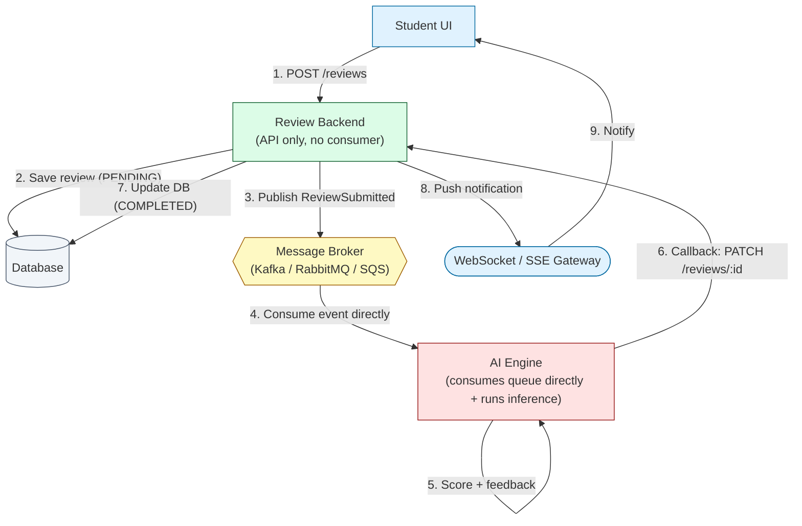
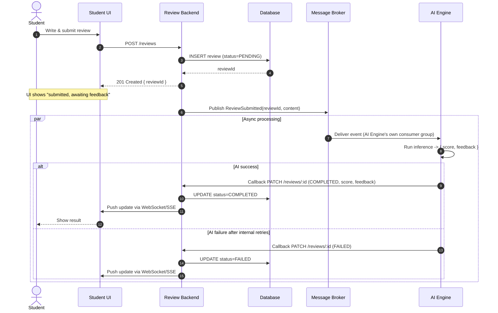
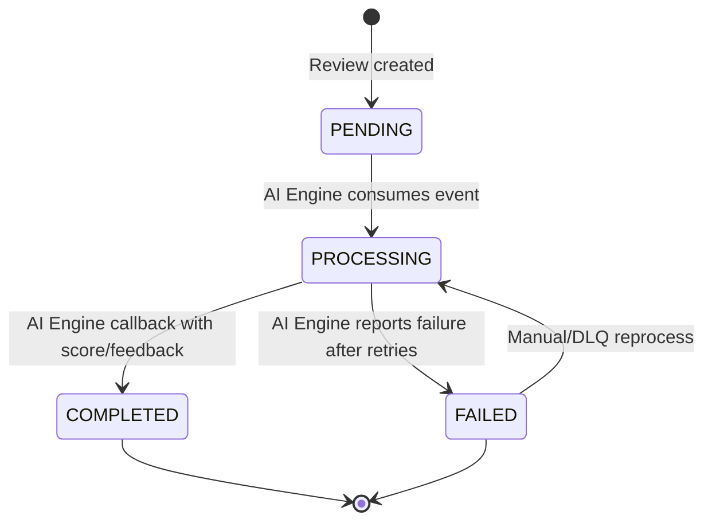

# AI-Assisted Review Pipeline — Architecture Design

## 1. Overview

This document describes an event-driven architecture for asynchronously scoring
and providing feedback on student-submitted reviews. The **AI Engine itself
consumes** the `ReviewSubmitted` event directly from the broker — there is no
separate AI Worker service, and the Review Backend does **not** run any
consumer logic. The Review Backend's only job is to expose the REST API
(write reviews, publish events) and receive a callback from the AI Engine
once scoring is done, then push the result to the UI.

**Goals:**
- Sub-second response time for review submission (UX must not wait on AI inference).
- Horizontal scalability of AI inference independent of API traffic.
- At-least-once delivery and resilience to AI Engine failures/timeouts.
- Real-time status updates to the client without polling.
- Minimal number of services: **Student UI → Review Backend → Broker → AI Engine → Review Backend → UI**.

---

## 2. Components

| Component | Responsibility | Notes |
|---|---|---|
| **Student UI** | Submits review via `POST /reviews`; subscribes to status updates | Web/mobile client |
| **Review Backend** | Owns review lifecycle & persistence; exposes REST API + realtime channel; publishes `ReviewSubmitted` events; receives result callback from AI Engine and updates DB | Stateless, horizontally scalable — **no consumer/worker logic** |
| **Message Broker** (Kafka / RabbitMQ / SQS) | Durable buffer between submission and AI processing | Decouples producer/consumer throughput |
| **AI Engine** | **Consumes** `ReviewSubmitted` events directly from the broker, runs inference, and **calls back** into Review Backend with the result | Owns its own consumer group; the only consumer of the queue |
| **Database** | Source of truth for review state (`PENDING` → `PROCESSING` → `COMPLETED`/`FAILED`) | Owned exclusively by Review Backend; AI Engine never touches it directly |
| **WebSocket/SSE Gateway** | Pushes completion notifications to connected clients | Can be part of Review Backend or a separate realtime service |

> **No AI Worker Service, no Review Backend consumer.** The AI Engine is
> itself the queue consumer. It pulls the event, scores it, and reports the
> result back to the Review Backend over HTTP/gRPC — the Review Backend
> stays a pure request/response API plus event publisher.

---

## 3. Data Model (minimal)

```text
Review {
  id: UUID (PK)
  studentId: UUID
  content: text
  status: enum [PENDING, PROCESSING, COMPLETED, FAILED]
  score: float (nullable)
  feedback: text (nullable)
  createdAt: timestamp
  updatedAt: timestamp
  attempts: int (default 0)
}
```

---

## 4. Flow Description

1. **Submission (synchronous, fast path)**
   - Student UI sends `POST /reviews` with review content.
   - Review Backend persists the row with `status = PENDING`.
   - Backend returns `201 Created` with the `reviewId` immediately — the
     student is *not* blocked on AI processing.

2. **Event publication**
   - Review Backend publishes a `ReviewSubmitted` event
     `{ reviewId, content, studentId }` to the broker.
   - This decouples the write path from AI throughput; if the AI Engine is
     slow or down, the queue simply absorbs backpressure.

3. **Direct consumption by AI Engine**
   - AI Engine instances (its own consumer group) pull the event directly
     from the broker — no intermediary worker service.
   - Optionally, AI Engine can fire a lightweight "processing started"
     callback so Review Backend can mark the row `PROCESSING`; otherwise it
     stays `PENDING` until the result arrives.

4. **Inference**
   - AI Engine scores the content and generates feedback in-process
     (`{ score, feedback }`).

5. **Result callback**
   - AI Engine calls back into the Review Backend, e.g.
     `PATCH /reviews/{id}` with `{ status: COMPLETED, score, feedback }`.
   - Review Backend updates the DB row to `COMPLETED` (or `FAILED` if AI
     Engine reports an unrecoverable error after its own internal retries).

6. **Real-time notification**
   - Review Backend pushes the update to the Student UI over WebSocket/SSE,
     keyed by `reviewId` or `studentId` session, so the UI updates live
     without polling.

---

## 5. Key Design Considerations

### Why let AI Engine consume directly?
- Removes an entire hop (no worker pulling from queue then calling AI
  Engine over HTTP) — fewer network calls, lower end-to-end latency.
- Fewer services to deploy/operate: Review Backend (API) + AI Engine
  (consumer + inference) + Broker + DB.
- AI Engine scales purely on queue depth/consumer lag, completely
  independent of Review Backend's HTTP traffic.

### Reliability
- **At-least-once delivery**: broker redelivers on AI Engine consumer
  crash; the result-callback to Review Backend must be **idempotent**
  (only transition to `COMPLETED` if not already `COMPLETED`, dedupe by
  `reviewId`).
- **Retry with backoff**: AI Engine retries its own inference call
  internally (e.g., transient model errors) before giving up and reporting
  `FAILED` to the Review Backend.
- **Dead-letter queue (DLQ)**: if AI Engine repeatedly fails to process an
  event, route it to a DLQ for manual inspection/reprocessing.
- **Callback delivery failure**: if the callback to Review Backend fails
  (network blip), AI Engine should retry the callback with backoff before
  giving up — otherwise the review is stuck `PENDING` forever. A periodic
  reconciliation job on Review Backend (sweep old `PENDING` rows) is a good
  safety net.

### Scalability
- AI Engine instances scale horizontally and independently of Review
  Backend — inference load doesn't affect submission latency.
- Kafka partitioning (or SQS FIFO groups) by `studentId` can preserve
  per-student ordering if needed.

### Consistency / UX
- The UI should treat `PENDING`/`PROCESSING` as an optimistic "submitted,
  awaiting feedback" state.
- WebSocket/SSE is preferred over polling to reduce load and give
  near-real-time feedback delivery.

### Observability
- Emit metrics at each hop: submission rate, queue depth, AI Engine
  consumer lag, inference latency, success/failure rate, callback latency.
- Correlate logs via `reviewId` across Review Backend → Broker → AI Engine
  → Review Backend callback.

### Security
- Validate/sanitize review content before it's placed on the queue (AI
  Engine will consume it as untrusted input either way).
- The AI Engine → Review Backend callback is a privileged write path:
  authenticate it (service-to-service auth, e.g. mTLS or a signed
  service JWT) and validate the payload before writing to the DB.

---

## 6. Mermaid Diagrams

### 6.1 Component / Architecture Diagram



### 6.2 Sequence Diagram (with timing/async semantics)



### 6.3 Review State Machine



---

## 7. Failure Modes & Mitigations

| Failure | Mitigation |
|---|---|
| Broker unavailable at publish time | Outbox pattern: write event to a local outbox table in the same DB transaction as the review insert, relay via a separate publisher process |
| AI Engine crashes mid-processing | Broker redelivers unacked message to another AI Engine instance; inference should be idempotent/side-effect-free until the callback fires |
| AI Engine inference error | Bounded internal retries with exponential backoff + jitter; on exhaustion, report `FAILED` via callback (don't just drop the event) |
| Callback to Review Backend fails (network) | AI Engine retries the callback with backoff; Review Backend runs a periodic reconciliation sweep for stuck `PENDING` rows past a timeout |
| Duplicate event delivery / duplicate callback | Idempotent update: only transition to `COMPLETED` if current status isn't already `COMPLETED`; dedupe by `reviewId` |
| WebSocket disconnected at notify time | Fall back to a lightweight `GET /reviews/:id/status` the UI can poll on reconnect |

---

## 8. Suggested Tech Stack (example)

- **Review Backend**: Node.js/NestJS or Spring Boot — REST API + WebSocket (Socket.IO) or SSE; publishes to broker; exposes an internal callback endpoint for AI Engine
- **Broker**: Kafka (high throughput, replay) or SQS (simpler ops, managed)
- **AI Engine**: consumer group + inference logic in one service (e.g., Python/FastAPI worker with a Kafka/SQS consumer loop, or a managed model server with a queue trigger)
- **DB**: PostgreSQL with `status` as an enum + index for fast queries, owned solely by Review Backend
