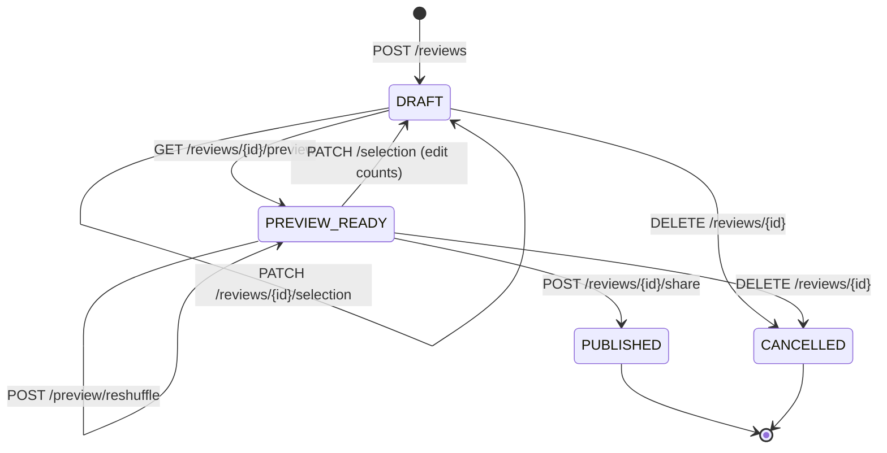
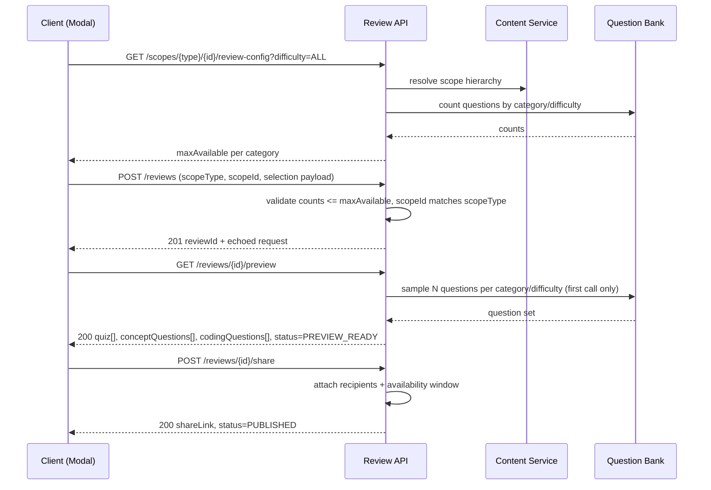
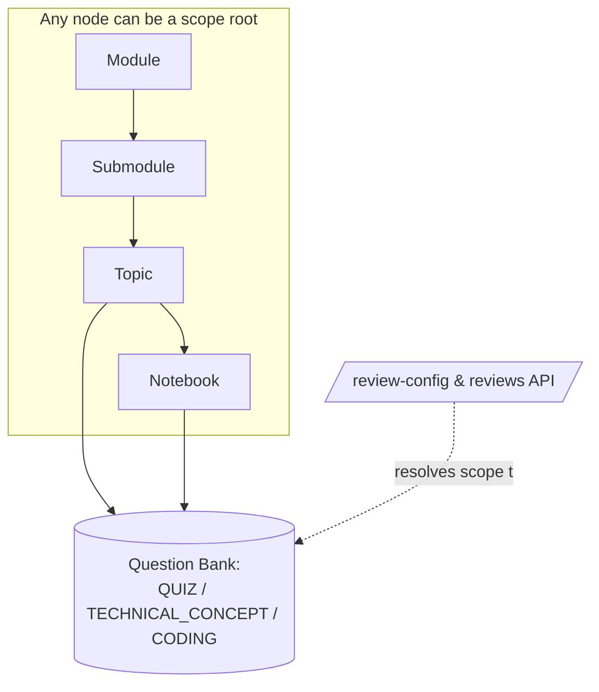

# Generate Review — API Specification

## 1. Design Goals

- **Scope-agnostic**: the same endpoints generate a review at `MODULE`, `SUBMODULE`, `TOPIC`, or `NOTEBOOK` level. The scope is just a `(scopeType, scopeId)` pair passed by the caller — the backend resolves the underlying content graph.
- **Wizard-aligned**: matches the 3-step UI (Selection → Preview → Share Review) as three distinct, resumable server states rather than one giant blocking call.
- **Config-driven counts**: "Max available" per category/difficulty is server-computed, never hardcoded on the client, since it depends on scope + difficulty filter.
- **Idempotent generation**: regenerating with the same selection params returns a cached preview instead of re-rolling questions, unless the user explicitly requests reshuffle.

---

## 2. Core Concepts

| Concept | Description |
|---|---|
| `scopeType` | `MODULE`, `SUBMODULE`, `TOPIC`, `NOTEBOOK` |
| `scopeId` | UUID of the entity at that level |
| `difficulty` | `ALL`, `BASIC`, `INTERMEDIATE`, `ADVANCED` |
| `category` | `QUIZ`, `TECHNICAL_CONCEPT`, `CODING` (extensible) |
| `reviewSession` | Server-side draft object created in step 1, mutated through steps 2–3 |

---

## 3. Endpoints

### 3.1 Get available question inventory (powers "Max available" + counters)

```
GET /api/v1/scopes/{scopeType}/{scopeId}/review-config?difficulty=ALL
```

**Response 200**
```json
{
  "scopeType": "TOPIC",
  "scopeId": "b3f1...",
  "difficulty": "ALL",
  "categories": [
    { "category": "QUIZ",              "label": "Quiz questions",        "maxAvailable": 6 },
    { "category": "TECHNICAL_CONCEPT", "label": "Technical Concepts",    "maxAvailable": 5 },
    { "category": "CODING",            "label": "Coding Questions",      "maxAvailable": 5 }
  ]
}
```
Called whenever the difficulty tab changes, to refresh `maxAvailable` per category live.

---

### 3.2 Create a review session (Step 1 — Selection)

`scopeId` is a **generic identifier** — its actual meaning depends on `scopeType`: it's a `moduleId` when `scopeType=MODULE`, a `subModuleId` when `scopeType=SUBMODULE`, a `topicId` when `scopeType=TOPIC`, a `notebookId` when `scopeType=NOTEBOOK`. The API doesn't care which — it just resolves `(scopeType, scopeId)` to a question pool via the internal scope resolver (see §8).

```
POST /api/v1/reviews
```

**Request**
```json
{
  "scopeType": "TOPIC",
  "scopeId": "b3f1...",
  "difficulty": "ALL",
  "timeLimit": 15,
  "selection": [
    { "category": "QUIZ",              "count": 6 },
    { "category": "TECHNICAL_CONCEPT", "count": 1 },
    { "category": "CODING",            "count": 3 }
  ]
}
```

**Validation rules (server-enforced, mirrored client-side for UX)**
- `sum(selection.count) >= 1`
- each `count <= maxAvailable` for that category/difficulty
- `timeLimit` within config bounds
- `scopeId` must exist and be of the entity type implied by `scopeType` (e.g. reject a `notebookId` passed with `scopeType=TOPIC`)

**Response 201**
```json
{
  "scopeType": "TOPIC",
  "scopeId": "b3f1...",
  "reviewId": "rvw_9f2a...",
  "difficulty": "ALL",
  "timeLimit": 15,
  "selection": [
    { "category": "QUIZ",              "count": 6 },
    { "category": "TECHNICAL_CONCEPT", "count": 1 },
    { "category": "CODING",            "count": 3 }
  ]
}
```
> Response echoes the accepted request verbatim (including `scopeType`/`scopeId`) plus the generated `reviewId` — the client already has everything else, so this just confirms what was persisted. `status`/`step`/`totalQuestions` are available via `GET /reviews/{reviewId}` if the UI needs them later, but aren't forced onto every create response.

**Errors**
| Code | Meaning |
|---|---|
| 400 | count exceeds maxAvailable, or invalid enum |
| 404 | scope not found |
| 422 | totalQuestions = 0 |

---

### 3.3 Fetch preview (Step 2 — Preview)

```
GET /api/v1/reviews/{reviewId}/preview
```
No request body. Materializes the question set on first call (random/weighted pick within the step-1 constraints) and returns it idempotently on subsequent calls — same `reviewId`, same questions, no reshuffle. (Need a reshuffle later? Add a separate `POST /reviews/{reviewId}/preview/reshuffle` rather than overloading this GET.)

**Response 200**
```json
{
  "reviewId": "rvw_9f2a...",
  "status": "PREVIEW_READY",
  "step": "PREVIEW",
  "timeLimit": 15,
  "quiz": [
    {
      "id": "6a43ecb3c7f9b6d452ee796a",
      "notebookId": "6a436abe6c863d3d02992b9b",
      "type": "MSQ",
      "question": "According to the 'Concepts learned by implementing UC1' section, which of the following are considered best practices for unit testing?",
      "options": [
        "A single assertion per test method for clarity.",
        "Using generic test names like `test1()` or `test2()`.",
        "Descriptive test names following the given-when-then pattern.",
        "Providing clear failure messages for debugging.",
        "Ignoring edge cases to keep tests concise."
      ],
      "validOptions": [
        "A single assertion per test method for clarity.",
        "Descriptive test names following the given-when-then pattern.",
        "Providing clear failure messages for debugging."
      ],
      "engineQuizQuestionId": "uc1-quiz-msq-2",
      "explanation": "The notebook explicitly lists unit testing best practices covering single assertions, descriptive given-when-then naming, and clear failure messages; generic test names and skipped edge cases contradict these.",
      "difficulty": "intermediate",
      "createdBy": 19,
      "createdAt": "2026-06-30T16:20:03.029Z",
      "updatedAt": "2026-06-30T16:20:03.029Z"
    }
  ],
  "conceptQuestions": [
    {
      "id": "6a43ecb7c7f9b6d452ee7972",
      "notebookId": "6a436abe6c863d3d02992b9b",
      "engineTechnicalQuestionId": "uc1-concept-1",
      "difficulty": "intermediate",
      "conceptQuestion": "The notebook highlights the importance of null checking and type checking in a robust equals() method implementation. Explain why these checks are crucial, referencing how getClass() is used for type safety, and describe the potential issues that could arise if they are omitted.",
      "createdBy": 19,
      "createdAt": "2026-06-30T16:20:07.620Z",
      "updatedAt": "2026-06-30T16:20:07.620Z"
    }
  ],
  "codingQuestions": [
    {
      "id": "6a43ecbdc7f9b6d452ee797a",
      "notebookId": "6a436abe6c863d3d02992b9b",
      "difficulty": "basic",
      "title": "Implement Feet Class with Custom equals()",
      "codingProblem": "Implement the Feet class in Java, including a constructor and an overridden equals() method. The class should represent a measurement in feet.",
      "codingInstructions": "1. Create a Feet class with a private final double value field to store the measurement.\n2. Implement a constructor that initializes this value.\n3. Override the equals() method to compare two Feet objects based on their value.\n4. Your equals() implementation must adhere to the following principles:\n    * Check for identity (this == obj).\n    * Handle null comparisons gracefully (return false if obj is null).\n    * Perform type checking using getClass() to ensure obj is an instance of Feet.\n    * Cast the obj to Feet safely.\n    * Compare the double values using Double.compare() for precise floating-point comparison.",
      "starterCode": "// Implement: Implement Feet Class with Custom equals()\n\n",
      "topics": [],
      "engineCodingQuestionId": "uc1-coding-1",
      "createdAt": "2026-06-30T16:20:13.237Z",
      "updatedAt": "2026-06-30T16:20:13.237Z"
    }
  ],
  "nextStep": "SHARE_REVIEW"
}
```

> The three arrays (`quiz`, `conceptQuestions`, `codingQuestions`) map 1:1 to the three category cards in the Selection modal (`QUIZ`, `TECHNICAL_CONCEPT`, `CODING`) — each array's length should equal the `count` requested for that category in step 1. Splitting by category here (instead of one flat `questions[]` with a `category` field) matches how the Preview screen will likely render — as separate sections/tabs per question type.

---

### 3.4 Share the review (Step 3 — Share Review)

```
POST /api/v1/reviews/{reviewId}/share
```

**Request**
```json
{
  "settings": {
    "allowRetake": false,
    "shuffleQuestionsPerUser": true
  }
}
```

**Response 200**
```json
{
  "reviewId": "rvw_9f2a...",
  "status": "PUBLISHED",
  "step": "SHARE_REVIEW",
  "shareLink": "https://app.example.com/review/rvw_9f2a"
}
```

---

### 3.5 List reviews by scope

```
GET /api/v1/reviews?scopeId={scopeId}&scopeType={scopeType}&status={status}&page={page}&limit={limit}
```

| Query param | Required | Description |
|---|---|---|
| `scopeId` | yes | the module/submodule/topic/notebook id |
| `scopeType` | recommended | `MODULE`, `SUBMODULE`, `TOPIC`, `NOTEBOOK` — disambiguates in the rare case an id collides across entity types |
| `status` | no | filter by `DRAFT`, `PREVIEW_READY`, `PUBLISHED`, `CANCELLED` |
| `page`, `limit` | no | pagination, defaults `page=1`, `limit=20` |

**Example**
```
GET /api/v1/reviews?scopeId=6a436abe6c863d3d02992b9b&scopeType=TOPIC&status=PUBLISHED
```

**Response 200**
```json
{
  "scopeType": "TOPIC",
  "scopeId": "6a436abe6c863d3d02992b9b",
  "total": 3,
  "page": 1,
  "limit": 20,
  "reviews": [
    {
      "reviewId": "rvw_9f2a...",
      "status": "PUBLISHED",
      "difficulty": "ALL",
      "timeLimit": 15,
      "totalQuizCount": 2,
      "totalConceptQuestionsCount": 2,
      "totalCodingQuestionsCount": 2,
      "createdAt": "2026-07-07T10:00:00Z",
      "updatedAt": "2026-07-07T10:05:00Z"
    }
  ]
}
```

---

### 3.6 Other supporting endpoints

```
GET    /api/v1/reviews/{reviewId}             # full session state (for resuming wizard)
PATCH  /api/v1/reviews/{reviewId}/selection   # edit step-1 params, resets to DRAFT
DELETE /api/v1/reviews/{reviewId}             # cancel draft
```

---

## 4. Data Model (simplified)

```json
ReviewSession {
  reviewId: string
  scopeType: enum(MODULE, SUBMODULE, TOPIC, NOTEBOOK)
  scopeId: string
  difficulty: enum(ALL, BASIC, INTERMEDIATE, ADVANCED)
  timeLimit: number
  selection: [{ category: string, count: number }]
  status: enum(DRAFT, PREVIEW_READY, PUBLISHED, CANCELLED)
  quiz: [QuizQuestion]                 // populated after preview
  conceptQuestions: [ConceptQuestion]  // populated after preview
  codingQuestions: [CodingQuestion]    // populated after preview
  shareConfig: ShareConfig | null
  createdBy: string
  createdAt: datetime
  updatedAt: datetime
}
```

---

## 5. Mermaid — Wizard State Machine



## 6. Mermaid — Sequence Diagram (end to end)



## 7. Mermaid — Scope Hierarchy (why scopeType/scopeId works generically)



---

## 8. Key senior-dev notes

- **Single source of truth for counts**: never trust client-sent `maxAvailable`; always re-validate server-side at `POST /reviews` time, since inventory can change between config fetch and submission.
- **Materialization is deferred to Preview**: keeps Step 1 cheap (just persists intent) and lets you support "reshuffle" without recreating the whole session.
- **Scope resolution is a single internal contract** (`resolveScope(scopeType, scopeId) -> questionPool`), so adding a 5th level later (e.g. `COURSE`) requires no API shape change — just a new resolver.
- **Idempotency key** recommended on `POST /reviews` to safely handle double-submits from the modal's "Next" button. `GET /preview` is naturally idempotent (safe to retry/refresh without side effects) since it only materializes once, on first call.
- **Versioning**: prefix with `/api/v1/` now so difficulty/category enums can evolve without breaking older clients.
